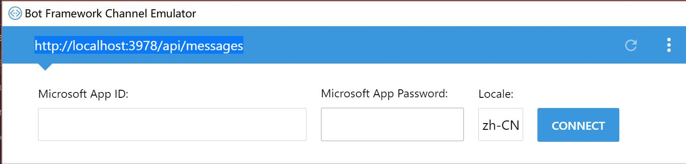
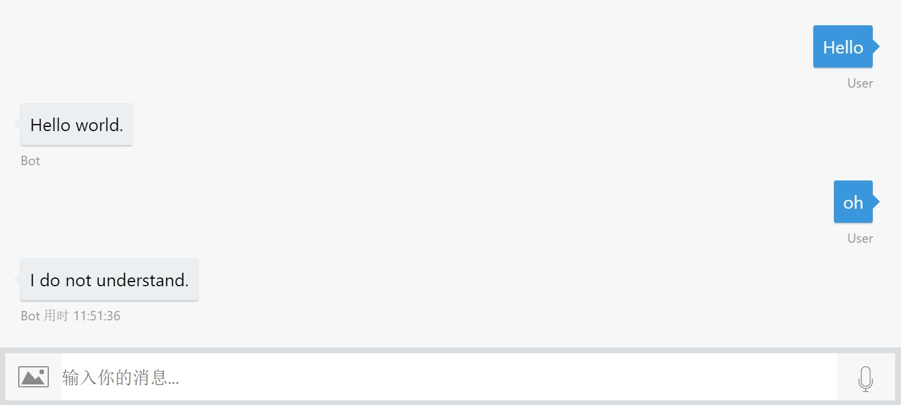

# Overview

Bot-framework 是微软推出的一个平台，这个平台将开发、测试、部署 bot 的一系列流程整合起来，极大地方便了开发者。bot 支持使用 Node.js 和 C# 进行开发，这个系列的文章将以 Node.js 平台下的 Bot-framework 开发作为主要介绍内容，目标是完成一个可以进行相对智能的人机交互任务的聊天机器人。

## 一些特性

Bot-framework 支持多 Conversion，用户可以根据需求，定义每个 Conversation 的触发条件和对话流程。

Bot-framework 支持自定义的卡片和按钮形式。用户可以自行制作卡片、表单、选项按钮等组件来丰富 bot 的外观。并且，bot 会自行根据所运行的平台，相对应地调整组件的外观。例如在 telegram 平台上，按钮组件就可以被非常完美地原生支持。

Bot-framework 支持多数聊天工具和网页界面，用户可以根据需求进行选择。


## 关于认知服务

文章中将会使用微软的认知服务 ( cognitive services ) 作为主要的"智能"驱动平台，包括 LUIS(Language Understanding Intelligent Service) 服务，QnAMaker 服务，Custom Vision 服务等，提高 bot 对语言的识别能力和对交互的优化能力。有关微软认知服务的详细的信息请参照  
[https://azure.microsoft.com/en-us/services/cognitive-services/](https://azure.microsoft.com/en-us/services/cognitive-services/)

# 环境配置

## Node.js 环境

```
npm install --save botbuilder
npm install --save restify
```

## Bot Framework Emulator

在[http://emulator.botframework.com/](http://emulator.botframework.com/)下载对应版本的本地模拟器

# Hello world

## 編碼

首先，将依赖引入程序
```
// This loads bot-framework requires
const builder = require('botbuilder');
const restify = require('restify');
```

创建 connector 和 bot
```
// Setup restify server
const server = restify.createServer();
server.listen(process.env.port || process.env.PORT || 3978, function () {
    console.log('%s listening to %s', server.name, server.url);
});

// Create connector and listen for messages
const connector = new builder.ChatConnector({
    appId: process.env.MICROSOFT_APP_ID,
    appPassword: process.env.MICROSOFT_APP_PASSWORD
});
server.post('/api/messages', connector.listen());

// Create a bot by connector
const bot = new builder.UniversalBot(connector, {});
```
之后，创建一个 Root dialog 
```
// Root dialog
bot.dialog('/', [
    function(session){
        let userMessage = session.message.text;

        if (userMessage === 'Hello'){
            session.send("Hello world.");
        }
        else{
            console.log("No answer.");
            session.send("I do not understand.");
        }
    }
]);
``` 

这样，一个简单的 bot 就做好了。我们向其发送一个 Hello ，它会回复我们 Hello world.

## 调试

该如何进行调试呢？首先运行bot，然后打开 Bot Framework Emulator ，按照图示填写地址。



位于右下角的日志栏显示
```
[11:46:45] -> POST 202 [conversationUpdate] 
[11:46:45] -> POST 202 [conversationUpdate] 
```
表示模拟器已经成功连接上 bot 了。  
让我们尝试发送几句对话


这样，一个简单的 Hello world bot 就完成了。
